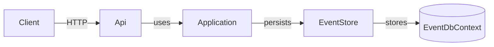

# CleanTemplate Documentation

## Architecture Overview

This template follows a clean architecture with clearly separated layers:

- **CleanTemplate.Domain** – core domain entities and events.
- **CleanTemplate.Application** – application services that orchestrate domain behavior.
- **CleanTemplate.Infrastructure** – EF Core implementation of the event store.
- **CleanTemplate.Api** – ASP.NET Core API exposing order endpoints.

## Flow Diagram

## Database Seeding

At startup the API seeds the in-memory event store with a sample order and one item. This is handled by `DataSeeder` in the API project.

1. An order is created.
2. A sample item (`"Sample"`, quantity `1`) is added.

This provides immediate data for testing the event sourcing flow.
